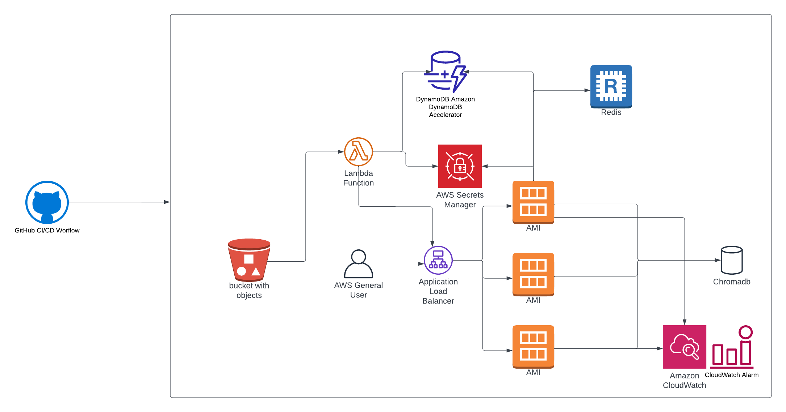

# Text based searching and indexing

This project is a RESTful API built using FastAPI that integrates with DynamoDB for data storage, redis for caching, Application load balancer for scaling up and down and ChromaDB for efficient text-based search capabilities.

## Architecture diagram



## Features

- Data indexing in DynamoDB and ChromaDB.
- Efficient text-based search using ChromaDB's embedding functions.
- Secure API key-based authentication.
- Logging capabilities with AWS CloudWatch.
- Event driven lambda invocation for bulk indexing of the data populated in the s3 bucket.
- Application load balancer for scaling up and down.
- Deployment of the infra through terraform.

## Directory Structure

\```
|_ main.py
|_ models/
   |_ schemas.py
|_ utils/
   |_ db.py
   |_ log.py
   |_ secrets.py
|_ middleware/
   |_ apikey.py
|_ config/
   |_ constants.py
\```

## Prerequisites

1. AWS account with access to DynamoDB and CloudWatch.
2. Python 3.8 or higher.
3. FastAPI and other dependencies from the `requirements.txt` file.

## Setup

As soon as the code is pushed to the repo, a gihub workflow is triggered. It cdoes the following things.
- Containarize the code, package it and push it to teh dokcer hub.
- Package and zip lambda.
- Deploy (Create, modify, delete) infrastructure through terraform.
- The github workflow is present in the .github/worflows/


After deploying you can check the application load balancer dns to hit the endpoints. Make sure you have the api token to actually hit the endpoints.

## API Endpoints

- **Index Data**  
  **Endpoint:** `/index/`  
  **Method:** POST  
  **Body:** 

\```json
{
  "question": "Your question here",
  "answer": "Your answer here",
  "form_type": "Your form type here"
}
\```

- **Search**  
  **Endpoint:** `/search/`  
  **Method:** POST  
  **Body:** 

\```json
{
  "question": "Your search query here"
}
\```

